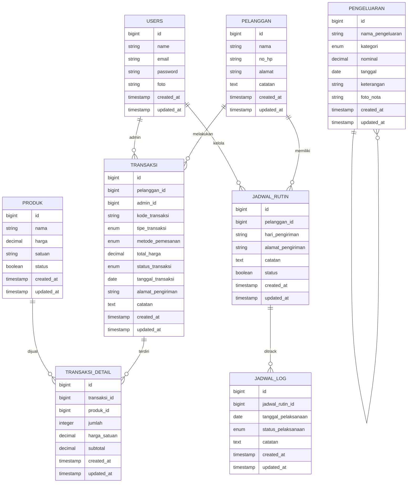

# Struktur Database - Depot Barokah Tirta

## Entity Relationship Diagram (ERD)



---

## Detail Struktur Tabel

### 1. **USERS** - Data Admin/Pengguna
```sql
CREATE TABLE users (
    id BIGINT UNSIGNED PRIMARY KEY AUTO_INCREMENT,
    name VARCHAR(255) NOT NULL,
    email VARCHAR(255) UNIQUE NOT NULL,
    email_verified_at TIMESTAMP NULL,
    password VARCHAR(255) NOT NULL,
    foto LONGTEXT NULL COMMENT "Path foto profil",
    remember_token VARCHAR(100) NULL,
    created_at TIMESTAMP NULL,
    updated_at TIMESTAMP NULL
);
```

**Fungsi**: Menyimpan data admin/pengguna sistem  
**Relasi**: 1 User → Many Transaksi, Many Jadwal Rutin

---

### 2. **PELANGGAN** - Data Pembeli/Pelanggan
```sql
CREATE TABLE pelanggan (
    id BIGINT UNSIGNED PRIMARY KEY AUTO_INCREMENT,
    nama VARCHAR(255) NOT NULL,
    no_hp VARCHAR(20) NOT NULL UNIQUE,
    alamat TEXT NOT NULL,
    catatan TEXT NULL,
    created_at TIMESTAMP NULL,
    updated_at TIMESTAMP NULL,
    
    INDEX idx_nama (nama),
    INDEX idx_no_hp (no_hp)
);
```

**Kolom**:
- `nama`: Nama lengkap pelanggan
- `no_hp`: Nomor WhatsApp/telepon untuk kontak
- `alamat`: Alamat default pengiriman
- `catatan`: Catatan khusus (misal: pintu belakang, gerbang terkunci)

**Fungsi**: Pusat data pelanggan  
**Relasi**: 1 Pelanggan → Many Transaksi, Many Jadwal Rutin

---

### 3. **PRODUK** - Katalog Produk/Jasa
```sql
CREATE TABLE produk (
    id BIGINT UNSIGNED PRIMARY KEY AUTO_INCREMENT,
    nama VARCHAR(255) NOT NULL,
    harga DECIMAL(10, 2) NOT NULL,
    satuan VARCHAR(50) NOT NULL COMMENT "pcs, galon, liter, dll",
    status BOOLEAN DEFAULT true COMMENT "true=aktif, false=nonaktif",
    created_at TIMESTAMP NULL,
    updated_at TIMESTAMP NULL,
    
    INDEX idx_nama (nama),
    INDEX idx_status (status)
);
```

**Contoh Produk**:
- Air Galon (Rp 18.000/galon)
- Tutup Galon (Rp 2.000/pcs)
- Tisu (Rp 5.000/pcs)
- Layanan Antar (Rp 5.000/pengiriman)

**Fungsi**: Katalog barang/jasa yang dijual  
**Relasi**: 1 Produk → Many Transaksi Detail

---

### 4. **TRANSAKSI** - Data Penjualan/Pesanan
```sql
CREATE TABLE transaksi (
    id BIGINT UNSIGNED PRIMARY KEY AUTO_INCREMENT,
    pelanggan_id BIGINT UNSIGNED NULL COMMENT "NULL = penjualan umum",
    user_id BIGINT UNSIGNED NOT NULL,
    kode_transaksi VARCHAR(50) UNIQUE NOT NULL COMMENT "TRX-DD-MM-YY-###",
    tipe_transaksi ENUM('langsung', 'antar') NOT NULL DEFAULT 'langsung',
    metode_pemesanan ENUM('wa', 'telepon', 'langsung') NOT NULL,
    total_harga DECIMAL(12, 2) NOT NULL,
    status_transaksi ENUM('pending', 'diproses', 'diantar', 'selesai', 'dibatalkan') NOT NULL DEFAULT 'pending',
    tanggal_transaksi DATE NOT NULL,
    alamat_pengiriman TEXT NULL COMMENT "Khusus tipe antar",
    catatan TEXT NULL,
    created_at TIMESTAMP NULL,
    updated_at TIMESTAMP NULL,
    
    FOREIGN KEY (pelanggan_id) REFERENCES pelanggan(id) ON DELETE SET NULL,
    FOREIGN KEY (user_id) REFERENCES users(id) ON DELETE RESTRICT,
    INDEX idx_kode_transaksi (kode_transaksi),
    INDEX idx_status (status_transaksi),
    INDEX idx_tanggal (tanggal_transaksi),
    INDEX idx_pelanggan (pelanggan_id)
);
```

**Kolom Penting**:
- `tipe_transaksi`: 'langsung' (beli di tempat) atau 'antar' (delivery)
- `metode_pemesanan`: Cara pelanggan memesan (WA/Telepon/Datang Langsung)
- `status_transaksi`: Workflow proses pesanan
- `alamat_pengiriman`: Bisa berbeda dari alamat pelanggan default

**Fungsi**: Inti sistem (mencatat setiap penjualan)  
**Relasi**: 1 Transaksi → Many Transaksi Detail, 1 Transaksi → 1 Pelanggan

---

### 5. **TRANSAKSI_DETAIL** - Detail Item Per Transaksi
```sql
CREATE TABLE transaksi_detail (
    id BIGINT UNSIGNED PRIMARY KEY AUTO_INCREMENT,
    transaksi_id BIGINT UNSIGNED NOT NULL,
    produk_id BIGINT UNSIGNED NOT NULL,
    jumlah INT NOT NULL,
    harga_satuan DECIMAL(10, 2) NOT NULL COMMENT "Harga saat transaksi",
    subtotal DECIMAL(12, 2) NOT NULL COMMENT "jumlah * harga_satuan",
    created_at TIMESTAMP NULL,
    updated_at TIMESTAMP NULL,
    
    FOREIGN KEY (transaksi_id) REFERENCES transaksi(id) ON DELETE CASCADE,
    FOREIGN KEY (produk_id) REFERENCES produk(id) ON DELETE RESTRICT,
    INDEX idx_transaksi (transaksi_id)
);
```

**Fungsi**: Breakdown item/produk dalam 1 transaksi  
**Contoh**: 
- 2 galon air @ Rp 18.000 = Rp 36.000
- 1 tutup galon @ Rp 2.000 = Rp 2.000
- Total: Rp 38.000

---

### 6. **JADWAL_RUTIN** - Jadwal Pengiriman Berulang
```sql
CREATE TABLE jadwal_rutin (
    id BIGINT UNSIGNED PRIMARY KEY AUTO_INCREMENT,
    pelanggan_id BIGINT UNSIGNED NOT NULL,
    hari_pengiriman VARCHAR(255) NOT NULL COMMENT "Senin,Rabu,Jumat atau JSON array",
    alamat_pengiriman TEXT NULL COMMENT "Bisa berbeda dari default",
    catatan TEXT NULL,
    status BOOLEAN DEFAULT true,
    created_at TIMESTAMP NULL,
    updated_at TIMESTAMP NULL,
    
    FOREIGN KEY (pelanggan_id) REFERENCES pelanggan(id) ON DELETE CASCADE,
    INDEX idx_pelanggan (pelanggan_id),
    INDEX idx_status (status)
);
```

**Contoh**:
- Pelanggan A: Senin, Rabu, Jumat setiap minggunya
- Pelanggan B: Setiap hari Selasa

**Fungsi**: Automasi pengingat jadwal pengiriman rutin  
**Relasi**: 1 Jadwal Rutin → Many Jadwal Log (tracking)

---

### 7. **JADWAL_LOG** - Log/History Pelaksanaan Jadwal
```sql
CREATE TABLE jadwal_log (
    id BIGINT UNSIGNED PRIMARY KEY AUTO_INCREMENT,
    jadwal_rutin_id BIGINT UNSIGNED NOT NULL,
    tanggal_pelaksanaan DATE NOT NULL,
    status_pelaksanaan ENUM('sukses', 'gagal', 'belum_dilaksanakan') NOT NULL DEFAULT 'belum_dilaksanakan',
    catatan TEXT NULL COMMENT "Alasan jika gagal",
    created_at TIMESTAMP NULL,
    updated_at TIMESTAMP NULL,
    
    FOREIGN KEY (jadwal_rutin_id) REFERENCES jadwal_rutin(id) ON DELETE CASCADE,
    INDEX idx_jadwal (jadwal_rutin_id),
    INDEX idx_tanggal (tanggal_pelaksanaan),
    UNIQUE KEY unique_jadwal_date (jadwal_rutin_id, tanggal_pelaksanaan)
);
```

**Fungsi**: Tracking setiap pelaksanaan jadwal rutin  
**Kegunaan**: Laporan akurasi pengiriman

---

### 8. **PENGELUARAN** - Pencatatan Biaya Operasional
```sql
CREATE TABLE pengeluaran (
    id BIGINT UNSIGNED PRIMARY KEY AUTO_INCREMENT,
    nama_pengeluaran VARCHAR(255) NOT NULL,
    kategori ENUM('operasional', 'pemeliharaan', 'bahan_baku', 'gaji', 'lainnya') NOT NULL,
    nominal DECIMAL(12, 2) NOT NULL,
    tanggal DATE NOT NULL,
    keterangan TEXT NULL,
    foto_nota LONGTEXT NULL COMMENT "Path foto struk/nota",
    created_at TIMESTAMP NULL,
    updated_at TIMESTAMP NULL,
    
    INDEX idx_kategori (kategori),
    INDEX idx_tanggal (tanggal),
    INDEX idx_nominal (nominal)
);
```

**Kategori Pengeluaran**:
- **Operasional**: Bensin, listrik, air, internet
- **Pemeliharaan**: Service mesin, perbaikan
- **Bahan Baku**: Galon baru, klorin, dll
- **Gaji**: Gaji karyawan
- **Lainnya**: Miscellaneous

**Fungsi**: Tracking semua biaya untuk kalkulasi laba bersih  
**Relasi**: Langsung dipakai dashboard untuk "Laba Bersih = Pendapatan - Pengeluaran"

---

## Relationships Overview

```
┌─────────────┐
│    USERS    │
└──────┬──────┘
       │ creates
       ├────→ TRANSAKSI
       └────→ JADWAL_RUTIN

┌─────────────┐
│  PELANGGAN  │
└──────┬──────┘
       │ has
       ├────→ TRANSAKSI
       └────→ JADWAL_RUTIN
              │ logs
              └────→ JADWAL_LOG

┌─────────────┐
│   PRODUK    │
└──────┬──────┘
       │ sold in
       └────→ TRANSAKSI_DETAIL

┌──────────────┐
│  TRANSAKSI   │
└──────┬───────┘
       │ contains
       └────→ TRANSAKSI_DETAIL

┌────────────────┐
│  PENGELUARAN   │
└────────────────┘
(Standalone untuk kalkulasi finansial)
```

---

## Index Strategy

| Tabel | Index | Tujuan |
|-------|-------|--------|
| `users` | PK(id) | Lookup admin |
| `pelanggan` | idx_nama, idx_no_hp | Search pelanggan |
| `produk` | idx_status | Filter aktif/nonaktif |
| `transaksi` | idx_kode, idx_status, idx_tanggal, FK(pelanggan_id) | Laporan, search |
| `transaksi_detail` | FK(transaksi_id), FK(produk_id) | Detail transaksi |
| `jadwal_rutin` | idx_status, FK(pelanggan_id) | Filter jadwal aktif |
| `jadwal_log` | FK(jadwal_id), idx_tanggal, UNIQUE(jadwal_id, tanggal) | Prevent duplicate logs |
| `pengeluaran` | idx_kategori, idx_tanggal | Laporan pengeluaran |

---

## Constraints & Data Integrity

### Foreign Keys
- ✅ `transaksi.pelanggan_id` → `pelanggan.id` (ON DELETE SET NULL - transaksi umum)
- ✅ `transaksi.user_id` → `users.id` (ON DELETE RESTRICT - jaga data integrity)
- ✅ `transaksi_detail.transaksi_id` → `transaksi.id` (ON DELETE CASCADE - auto hapus saat transaksi dihapus)
- ✅ `transaksi_detail.produk_id` → `produk.id` (ON DELETE RESTRICT - jaga history harga)
- ✅ `jadwal_rutin.pelanggan_id` → `pelanggan.id` (ON DELETE CASCADE)
- ✅ `jadwal_log.jadwal_rutin_id` → `jadwal_rutin.id` (ON DELETE CASCADE)

### Unique Constraints
- ✅ `users.email` UNIQUE
- ✅ `pelanggan.no_hp` UNIQUE
- ✅ `transaksi.kode_transaksi` UNIQUE
- ✅ `jadwal_log` (jadwal_rutin_id, tanggal_pelaksanaan) UNIQUE - cegah duplikat log

---

## Data Types Reference

| Tipe | Kegunaan | Range |
|------|----------|-------|
| `BIGINT UNSIGNED` | ID (Primary Key) | 0 - 18,446,744,073,709,551,615 |
| `VARCHAR(255)` | Nama, teks pendek | Max 255 karakter |
| `TEXT` | Teks panjang | Max 65,535 karakter |
| `LONGTEXT` | File path | Max 4GB |
| `DECIMAL(12,2)` | Harga, uang | 12 digit, 2 desimal (Rp 9,999,999.99) |
| `DATE` | Tanggal saja | YYYY-MM-DD |
| `TIMESTAMP` | Tanggal + waktu | Auto-update pada perubahan |
| `ENUM` | Pilihan terbatas | Case-insensitive, efisien |
| `BOOLEAN` | True/False | 0 atau 1 |

---

## Kesimpulan

Struktur database ini dirancang untuk:
- ✅ **Scalability**: Support ribuan transaksi
- ✅ **Data Integrity**: Foreign keys, constraints, unique indexes
- ✅ **Performance**: Strategic indexing untuk query cepat
- ✅ **Audit Trail**: Timestamps, jadwal_log untuk tracking
- ✅ **Flexibility**: Transaksi umum (nullable pelanggan_id), tipe transaksi, metode pemesanan
- ✅ **Financial Accuracy**: Detail item, pengeluaran tracking, laba calculation
